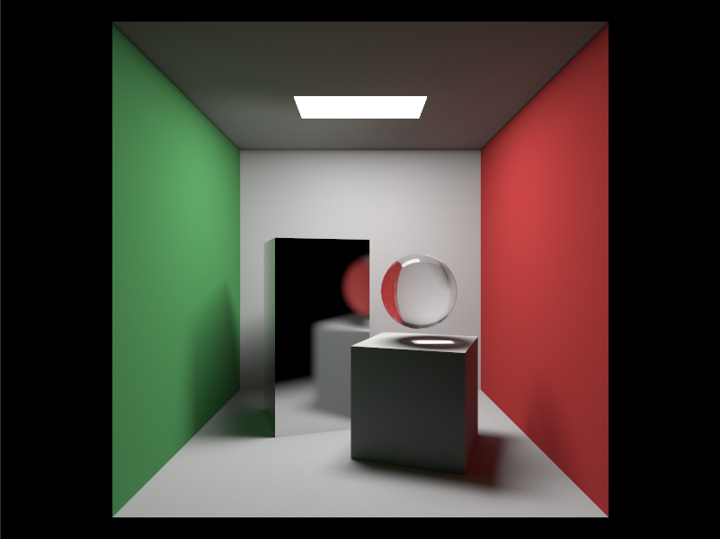
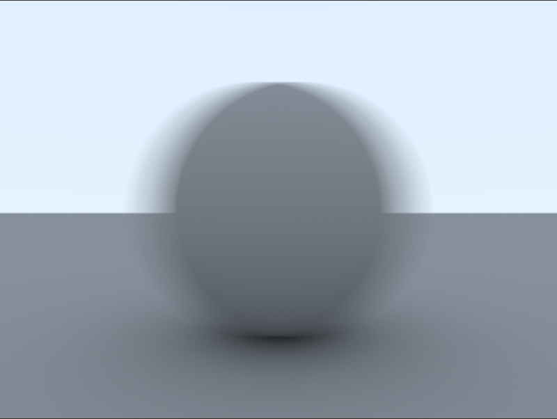
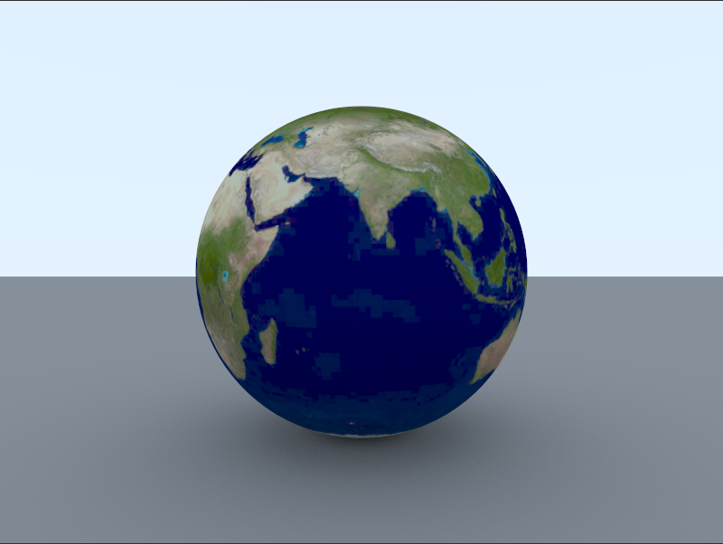
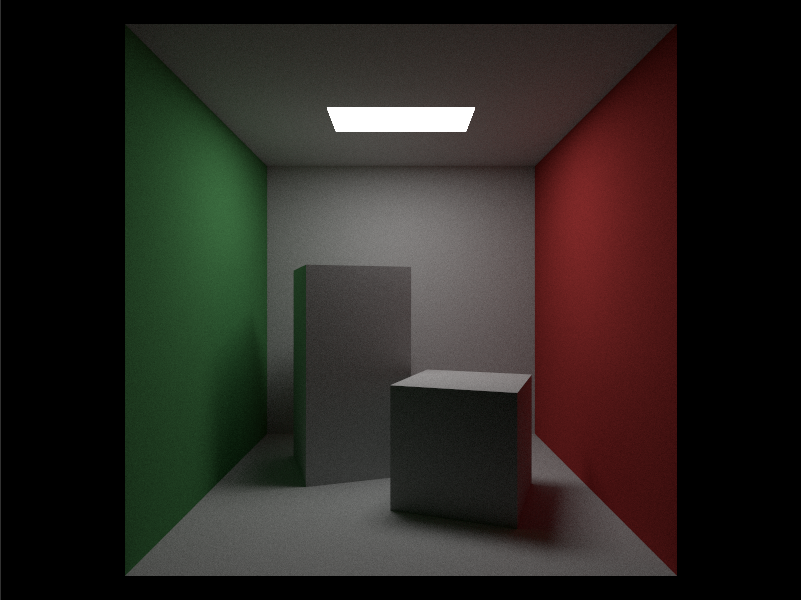
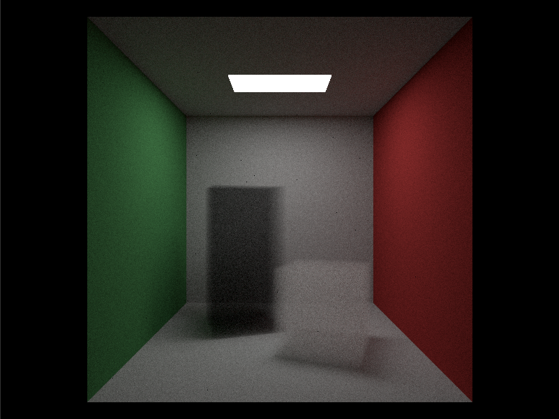

# GPU Ray Tracing in Rest of Your Life by Unity 2019.3

目录：
<!-- TOC -->

- [GPU Ray Tracing in Rest of Your Life by Unity 2019.3](#gpu-ray-tracing-in-rest-of-your-life-by-unity-20193)
- [1. 综述](#1-%e7%bb%bc%e8%bf%b0)
- [2. 运动模糊](#2-%e8%bf%90%e5%8a%a8%e6%a8%a1%e7%b3%8a)
  - [2.1. C#代码](#21-c%e4%bb%a3%e7%a0%81)
  - [2.2. 最终输出](#22-%e6%9c%80%e7%bb%88%e8%be%93%e5%87%ba)
- [3. 加速结构和Perlin Noise](#3-%e5%8a%a0%e9%80%9f%e7%bb%93%e6%9e%84%e5%92%8cperlin-noise)
- [4. 贴图](#4-%e8%b4%b4%e5%9b%be)
  - [4.1. Shader代码](#41-shader%e4%bb%a3%e7%a0%81)
  - [4.2. 最终输出](#42-%e6%9c%80%e7%bb%88%e8%be%93%e5%87%ba)
- [5. 光源](#5-%e5%85%89%e6%ba%90)
  - [5.1. Shader代码](#51-shader%e4%bb%a3%e7%a0%81)
  - [5.2. 最终输出](#52-%e6%9c%80%e7%bb%88%e8%be%93%e5%87%ba)
- [6. Volume渲染](#6-volume%e6%b8%b2%e6%9f%93)
  - [6.1. Shader代码](#61-shader%e4%bb%a3%e7%a0%81)
  - [6.2. 最终输出](#62-%e6%9c%80%e7%bb%88%e8%be%93%e5%87%ba)
- [7. PDF](#7-pdf)
  - [7.1. Shader代码](#71-shader%e4%bb%a3%e7%a0%81)
  - [7.2. 最终输出](#72-%e6%9c%80%e7%bb%88%e8%be%93%e5%87%ba)
- [源代码工程](#%e6%ba%90%e4%bb%a3%e7%a0%81%e5%b7%a5%e7%a8%8b)

<!-- /TOC -->

# 1. 综述
本文基于 [https://raytracing.github.io]() 的《Ray Tracing The Next Week》和《Ray Tracing The Rest of Your Life》介绍如何使用Unity 2019.3、SRP和DXR实现Ray Tracing。

因此在阅读本文之前，需要首先阅读《Ray Tracing The Next Week》和《Ray Tracing The Rest of Your Life》。本文不会对《Ray Tracing The Next Week》和《Ray Tracing The Rest of Your Life》文中已经解释清楚的算法做重复解释。本文中提到的“原文”均指《Ray Tracing The Next Week》和《Ray Tracing The Rest of Your Life》。

本文的重点放在如何在Unity 2019.3中实现同原文一样的Ray Tracing渲染。



由于原文中阐述了大量算法与渲染原理，实际渲染内容不多，故原来两文合并为本文一文在Unity 2019.3中实现。

# 2. 运动模糊
实现此渲染方法比较简单，原文通过随机在运动期间采样的方法实现。
```c
vec3 moving_sphere::center(float time) const{
    return center0 + ((time - time0) / (time1 - time0)) * (center1 - center0);
}
```
## 2.1. C#代码
在Unity中使用一个辅助Componment实现。
```csharp
public class RandomMove : MonoBehaviour
{
  private Animation _anim;
  private AnimationState _state;

  public void Awake()
  {
    _anim = GetComponent<Animation>();
    _state = _anim.PlayQueued("Movement", QueueMode.PlayNow, PlayMode.StopAll);
    _state.speed = 0.0f;
  }

  public void Update()
  {
    SceneManager.Instance.isDirty = true;
    _state.normalizedTime = Random.value;
  }
}
```
**Awake**时设置动画播放速度为0，方便之后的控制。

**Update**随机产生动画的*normalizedTime*，随机播放动画。

## 2.2. 最终输出


# 3. 加速结构和Perlin Noise
Unity集成的DXR已经实现的加速结构BVH，并且暴露了非常直观的API，前文“GPU Ray Tracing in One Weekend by Unity 2019.3”已做过相应介绍，不再赘述。

Perlin Noise在Unity中也非常容易使用Compute Shader生成，且和Ray Tracing关系不大，不做过多介绍。

# 4. 贴图
在Unity集成的DXR使用贴图需要对之前的*closesthit shader*增加如下代码。

## 4.1. Shader代码
```glsl
Properties
  {
    _Color ("Main Color", Color) = (1,1,1,1)
    _BaseColorMap("BaseColorMap", 2D) = "white" {}
  }

...

Texture2D _BaseColorMap;
Texture2D sampler_BaseColorMap;

struct IntersectionVertex
{
  float3 normalOS;
  float2 texCoord0;
};

void FetchIntersectionVertex(uint vertexIndex, out IntersectionVertex outVertex)
{
  outVertex.normalOS = UnityRayTracingFetchVertexAttribute3(vertexIndex, kVertexAttributeNormal);
  outVertex.texCoord0  = UnityRayTracingFetchVertexAttribute2(vertexIndex, kVertexAttributeTexCoord0);
}

[shader("closesthit")]
void ClosestHitShader(inout RayIntersection rayIntersection : SV_RayPayload, AttributeData attributeData : SV_IntersectionAttributes)
{
  ...

  float2 texCoord0 = INTERPOLATE_RAYTRACING_ATTRIBUTE(v0.texCoord0, v1.texCoord0, v2.texCoord0, barycentricCoordinates);
  float4 texColor = _Color * _BaseColorMap.SampleLevel(sampler_BaseColorMap, texCoord0, 0);
  ...
}
```
材质定义部分增加了贴图属性*_BaseColorMap*，后续获取顶点数据时使用 *UnityRayTracingFetchVertexAttribute2(vertexIndex, kVertexAttributeTexCoord0)* 获取UV，再通过*SampleLevel*进行纹理采样就完成了所有操作。

## 4.2. 最终输出


# 5. 光源

光源的实现相对简单。

## 5.1. Shader代码
```glsl
[shader("closesthit")]
void ClosestHitShader(inout RayIntersection rayIntersection : SV_RayPayload, AttributeData attributeData : SV_IntersectionAttributes)
{
  rayIntersection.color = float4(texColor.rgb * _Intensity, 1.0f);
}
```

只需要在发生光线碰撞时返回光源的颜色及其强度即可。

## 5.2. 最终输出


# 6. Volume渲染

Volume的渲染原文中已做过详细的阐述，实现也相对复杂。

## 6.1. Shader代码
```glsl
[shader("closesthit")]
void ClosestHitShader(inout RayIntersection rayIntersection : SV_RayPayload, AttributeData attributeData : SV_IntersectionAttributes)
{
  if (rayIntersection.remainingDepth < 0) // is inner ray.
  {
    rayIntersection.hitT = RayTCurrent();
    return;
  }
  
  float t1 = RayTCurrent();
  RayDesc rayDescriptor;
  rayDescriptor.Origin = WorldRayOrigin();
  rayDescriptor.Direction = WorldRayDirection();
  rayDescriptor.TMin = t1 + 1e-5f;
  rayDescriptor.TMax = _CameraFarDistance;

  RayIntersection innerRayIntersection;
  innerRayIntersection.remainingDepth = min(-1, rayIntersection.remainingDepth - 1);
  innerRayIntersection.PRNGStates = rayIntersection.PRNGStates;
  innerRayIntersection.color = float4(0, 0, 0, 0);
  innerRayIntersection.hitT = 0.0f;
  TraceRay(_AccelerationStructure, RAY_FLAG_CULL_FRONT_FACING_TRIANGLES, 0xFF, 0, 1, 0, rayDescriptor, innerRayIntersection);
  float t2 = innerRayIntersection.hitT;

  float distanceInsideBoundary = t2 - t1;
  float hitDistance = -(1.0f / _Density) * log(GetRandomValue(rayIntersection.PRNGStates));

  if (hitDistance < distanceInsideBoundary)
  {
    const float t = t1 + hitDistance;
    rayDescriptor.Origin = rayDescriptor.Origin + t * rayDescriptor.Direction;
    rayDescriptor.Direction = GetRandomOnUnitSphere(rayIntersection.PRNGStates);
    rayDescriptor.TMin = 1e-5f;
    rayDescriptor.TMax = _CameraFarDistance;

    RayIntersection scatteredRayIntersection;
    scatteredRayIntersection.remainingDepth = rayIntersection.remainingDepth - 1;
    scatteredRayIntersection.PRNGStates = rayIntersection.PRNGStates;
    scatteredRayIntersection.color = float4(0, 0, 0, 0);
    TraceRay(_AccelerationStructure, RAY_FLAG_CULL_BACK_FACING_TRIANGLES, 0xFF, 0, 1, 0, rayDescriptor, scatteredRayIntersection);
    rayIntersection.PRNGStates = scatteredRayIntersection.PRNGStates;
    rayIntersection.color = _Color * scatteredRayIntersection.color;
  }
  else
  {
    const float t = t2 + 1e-5f;
    rayDescriptor.Origin = rayDescriptor.Origin + t * rayDescriptor.Direction;
    rayDescriptor.Direction = rayDescriptor.Direction;

    rayDescriptor.TMin = 1e-5f;
    rayDescriptor.TMax = _CameraFarDistance;

    RayIntersection scatteredRayIntersection;
    scatteredRayIntersection.remainingDepth = rayIntersection.remainingDepth - 1;
    scatteredRayIntersection.PRNGStates = rayIntersection.PRNGStates;
    scatteredRayIntersection.color = float4(0, 0, 0, 0);
    TraceRay(_AccelerationStructure, RAY_FLAG_CULL_BACK_FACING_TRIANGLES, 0xFF, 0, 1, 0, rayDescriptor, scatteredRayIntersection);
    rayIntersection.PRNGStates = scatteredRayIntersection.PRNGStates;
    rayIntersection.color = scatteredRayIntersection.color;
  }
}
```
原文中渲染Volume需要知道Volume的厚度，但由于Unity 2019.3并不支持多hitgroup，因此要计算Volume只能使用一些Hack方法。
代码头部关于*rayIntersection.remainingDepth*小于0的判断用于在第二次光线检测时计算Volume的厚度使用。

```glsl
float t1 = RayTCurrent();
RayDesc rayDescriptor;
rayDescriptor.Origin = WorldRayOrigin();
rayDescriptor.Direction = WorldRayDirection();
rayDescriptor.TMin = t1 + 1e-5f;
rayDescriptor.TMax = _CameraFarDistance;

RayIntersection innerRayIntersection;
innerRayIntersection.remainingDepth = min(-1, rayIntersection.remainingDepth - 1);
innerRayIntersection.PRNGStates = rayIntersection.PRNGStates;
innerRayIntersection.color = float4(0, 0, 0, 0);
innerRayIntersection.hitT = 0.0f;
TraceRay(_AccelerationStructure, RAY_FLAG_CULL_FRONT_FACING_TRIANGLES, 0xFF, 0, 1, 0, rayDescriptor, innerRayIntersection)
```
光线到达Volume表面时继续向Volume内部发射光线，这次将裁剪面反转。这里*remaininigDepth*取-1。

后续代码根据*_Density*计算本次光线是该随机散射还是径直穿过Volume。如对以上代码存在不理解的地方请仔细阅读原文关于Volume渲染的原理解释。

## 6.2. 最终输出


# 7. PDF
原文《Ray Tracing The Rest of Your Life》全文通篇都在讲述PDF在Monte Carlo Program中的重要性，以及如何通过重要性采样尽可能的降低渲染Noise。

## 7.1. Shader代码
```glsl
struct ONB {
  float3 u;
  float3 v;
  float3 w;
};

void ONBBuildFromW(inout ONB uvw, float3 n) {
  uvw.w = n;
  float3 a;
  if (abs(uvw.w.x) > 0.0f)
    a = float3(0.0f, 1.0f, 0.0f);
  else
    a = float3(1.0f, 0.0f, 0.0f);
  uvw.v = normalize(cross(uvw.w, a));
  uvw.u = cross(uvw.w, uvw.v);
}

float3 ONBLocal(inout ONB uvw, float3 a) {
  return a.x * uvw.u + a.y * uvw.v + a.z * uvw.w;
}

float ScatteringPDF(float3 inOrigin, float3 inDirection, float inT, float3 hitNormal, float3 scatteredDir)
{
  float cosine = dot(hitNormal, scatteredDir);
  return max(0.0f, cosine / M_PI);
}

float3 GetRandomCosineDirection(inout uint4 states) {
  float r1 = GetRandomValue(states);
  float r2 = GetRandomValue(states);
  float z = sqrt(1.0f - r2);
  float phi = 2.0f * M_PI * r1;
  float x = cos(phi) * sqrt(r2);
  float y = sin(phi) * sqrt(r2);
  return float3(x, y, z);
}

[shader("closesthit")]
void ClosestHitShader(inout RayIntersection rayIntersection : SV_RayPayload, AttributeData attributeData : SV_IntersectionAttributes)
{
  ...

  // Make reflection ray.
  ONB uvw;
  ONBBuildFromW(uvw, normalWS);
  float3 scatteredDir;
  float pdf;

  if (GetRandomValue(rayIntersection.PRNGStates) < 0.5f)
  {
    scatteredDir = ONBLocal(uvw, GetRandomCosineDirection(rayIntersection.PRNGStates));
    pdf = dot(normalWS, scatteredDir) / M_PI;
  }
  else
  {
    const float3 _FakeLightMin = float3(-106.5f, 554.0f, -52.5f);
    const float3 _FakeLightMax = float3( 106.5f, 554.0f,  52.5f);
    float3 onLight = float3(
      _FakeLightMin.x + GetRandomValue(rayIntersection.PRNGStates) * (_FakeLightMax.x - _FakeLightMin.x),
      _FakeLightMin.y,
      _FakeLightMin.z + GetRandomValue(rayIntersection.PRNGStates) * (_FakeLightMax.z - _FakeLightMin.z));
    float3 toLight = onLight - positionWS;
    float distanceSquared = toLight.x * toLight.x + toLight.y * toLight.y + toLight.z * toLight.z;
    toLight = normalize(toLight);
    if (dot(toLight, normalWS) < 0.0f)
    {
      scatteredDir = ONBLocal(uvw, GetRandomCosineDirection(rayIntersection.PRNGStates));
      pdf = dot(normalWS, scatteredDir) / M_PI;
    }
    float lightArea = (_FakeLightMax.x - _FakeLightMin.x) * (_FakeLightMax.z - _FakeLightMin.z);
    float lightConsin = abs(toLight.y);
    if (lightConsin < 1e-5f)
    {
      scatteredDir = ONBLocal(uvw, GetRandomCosineDirection(rayIntersection.PRNGStates));
      pdf = dot(normalWS, scatteredDir) / M_PI;
    }
    scatteredDir = toLight;
    pdf = distanceSquared / (lightConsin * lightArea);
  }

  ...
}
```

ONB用于定义一个以Normal为W向量的正交基，原理参看原文。

**ScatteringPDF**为散射PDF。

**GetRandomCosineDirection**产生上半求内的随机向量。

**if (GetRandomValue(rayIntersection.PRNGStates) < 0.5f)** 用于随机50%的概率去采样我们定义的光源，另外50%概率去采样基于Normal的半球。

## 7.2. 最终输出


# 源代码工程
[https://github.com/zhing2006/GPU-Ray-Tracing-in-Rest-of-Your-Life-by-Unity-2019.3](https://github.com/zhing2006/GPU-Ray-Tracing-in-Rest-of-Your-Life-by-Unity-2019.3)
